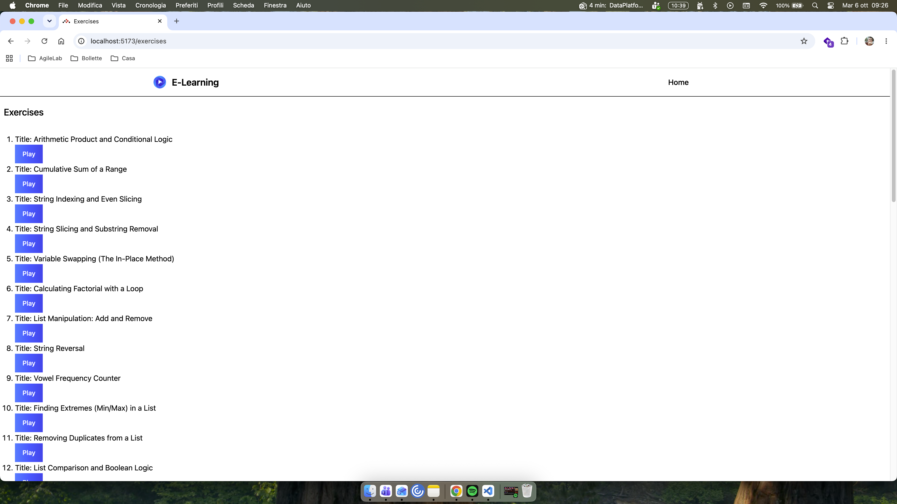
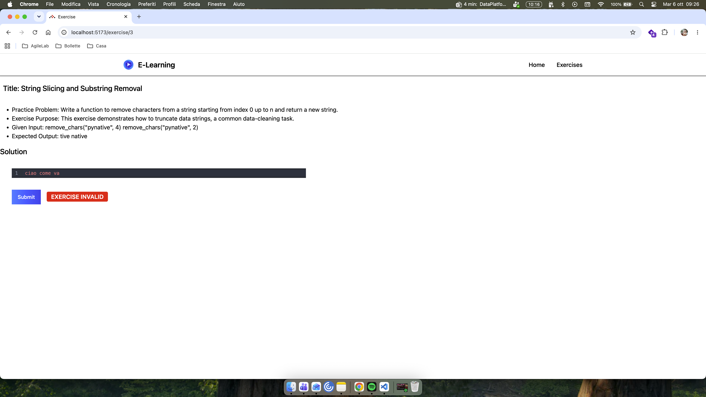
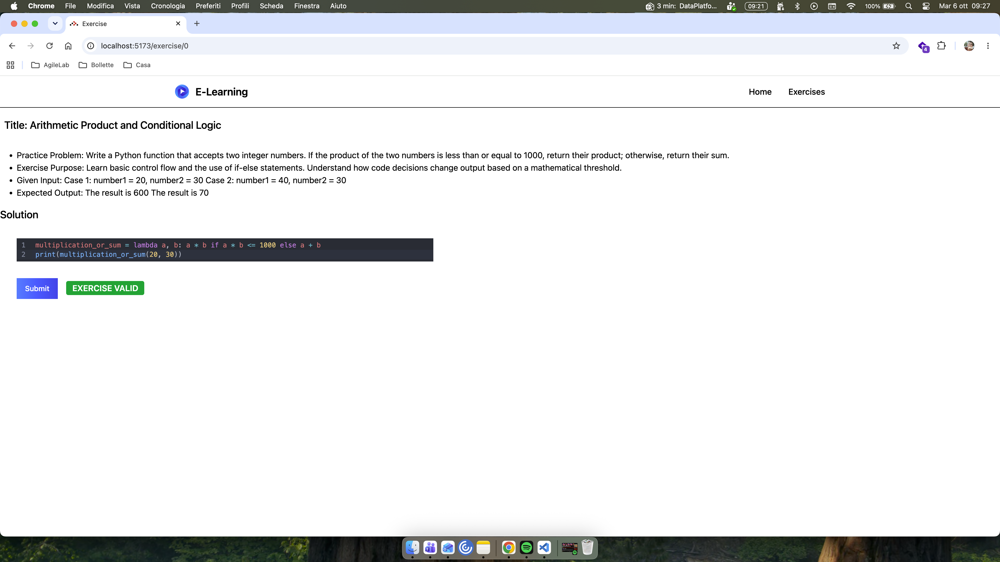

# Python Code Validator with LLM

## Get Started 


```bash
python -m venv venv
make install
make sample_syntax_exercises
make sample_correctness_validator

```


### Scripts 


- `make sample_syntax_exercises`: Run several exercises of syntax validation , just a language compiler simulation.
- `make sample_correctness_validator`: Run several exercises to evalute the correctness of python challenges.
- `make sample_syntax_validator`: Validate the syntax of a little batch of python code.
- `make sample_correctness_exercises`: Run one exercise to evalute the correctness of python challenges.

# Run the Interactive Validator

```bash
make run_backend
```

Open a new bash window

```bash
make run_frontend
```


You'll find a list of courses and exercises that you can interactively validate using a practical Python IDE.

Samples :





